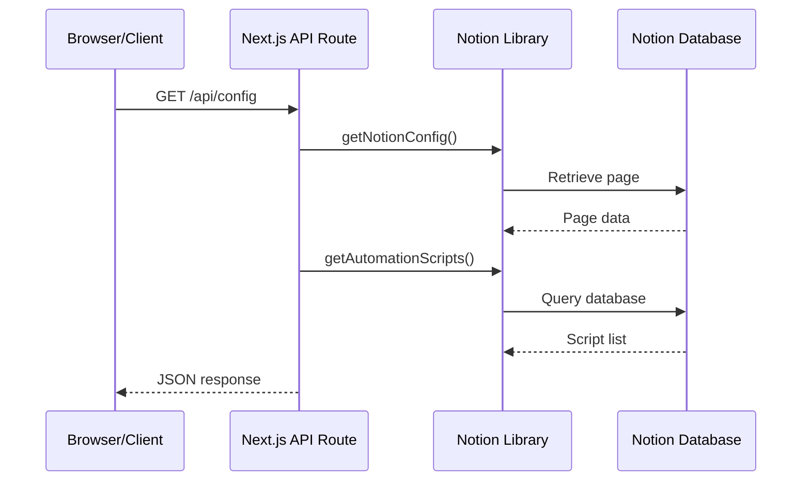

# Request Flow

This document describes the high-level flow of a client request through the API layer down to the Notion database.

## Steps

1. The browser sends a `GET` request to **/api/config**.
2. `src/pages/api/config.js` handles the request and calls helper functions from `src/lib/notion.js`.
3. `getNotionConfig` retrieves configuration data from the configured Notion page using the Notion API.
4. `getAutomationScripts` queries the Notion database containing automation scripts.
5. The API route formats the returned data into an application configuration object.
6. The server sends the JSON configuration back to the client.
